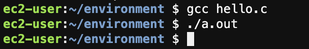
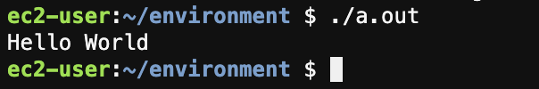
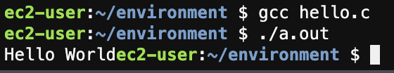

# Introduction

In the previous reading we used a simple program called "hello.c" in order to test whether our development environment was working.

The content of this program is the following:

```
# include <stdio.h>

int main()
{
	printf("Hello world\n");
	return 0;
}
```

This program, called the Hello World program, is the standard introductory program used for most programming languages. It is simple, ensures the ability of the student to save, compile, and run a program, and has an output.

In this segment we will break down the syntax of this program and what each piece of it means, show what happens when certain necessary parts are removed, all so that we can get ready to start making more interesting programs.

# The Scaffolding

When we run this program, we get the output:

```
Hello world
```

From looking at the program, you might guess that the line that actually accomplishes this is:

```
	printf("Hello world\n");
```

We will talk about how this line works in a little bit, but before that I want to discuss the surrounding lines.

If we remove the printf line from the program we have the following:

```
#include <stdio.h>

int main()
{
	return 0;
}
```

If we save, compile, and run this, nothing happens:



If we aren't using the print line, we actually don't need the following line either:

```
#include <stdio.h>
```

The remaining program is now:

```
int main()
{
	return 0;
}
```

Now again, when we run this, nothing happens, and that is actually exactly what this program is supposed to do.

Furthermore, by default, the line:

```
return 0;
```

Is implicitly added to a program during the compilation process, so it doesn't need to be there either.

This results in the final form of the do nothing program:

```
int main() {

}
```

Technically what this code says to do is do nothing and then exit, but it is more important than that.

This program is important because this is the minimum code necessary to run a C program. Without this code, your program will not compile or run. You cannot remove any part of this program (other than spacing) without getting a compiler error.

Furthermore, this is the starting point for every program you will write in this class. For each programming assignment, you will at some point have to include this code (along with many other lines) in your submission. Typically, this will be one of the very first things I write out when I am making a new program.

Now that I have explained the importance of this code, let's break down what each part of it means.

## int 
The keyword int, which is short for integer, represents a number data type. We are going to cover data types extensively next week. Having int before main says to the compiler to expect the main program to give back a number when it is done. By "give back" I mean that this program **returns** a value to the terminal when it completes.

As I said before, the compiler automatically and implicitly adds the line:

```
return 0;
```

To main when it compiles the code. So while it doesn't look like we are returning a number, the compiler is making sure that our executable does that without us having to code it. 

### Why does this program need to return a number?

When the makers of C designed how it would work, they decided that the main part of any program should return a numerical value to indicate whether it completed successfully or encountered an error. While we don't typically see this returned value when running the program in the terminal, more advanced programs can run other programs and see what the returned value was in order to tell whether executing the program worked or not.

0 is the value returned when the program completed successfully.

We won't be writing such advanced programs in this class, so for now we just need to accept that the int before main is a necessary part of the syntax to create a program that can be executed.


## main

When maing the executable for your program, the compiler needs to know where to begin execution.

The use of the word main was used for that special designation because it signifies that start of the main program. 

If we try replacing main with anything else, we get what is called a "linker error" because the compiler doesn't know where execution is supposed to start for our program.

For example trying to compile the following program:

```
int nick() {

}
```

Produces the following result

```
ec2-user:~/environment $ gcc hello.c
/usr/lib/gcc/x86_64-amazon-linux/7/../../../../lib64/crt1.o: In function `_start':
(.text+0x20): undefined reference to `main'
collect2: error: ld returned 1 exit status
ec2-user:~/environment $ 
```

This is our first example of a compiler error.

### What is a compiler error?

When you compile a program, the compiler is trying to make sense of your source code and turn it into binary instructions that the computer can execute. The compiler is built to be very fast at translating code in specific formats that it can easily understand. Without these syntax rules, it would be too difficult for the compiler to make sense out of all of the different ways a human could say to do a problem.

Of course, humans are not perfect at following specific rules for syntax. We make mistakes in English all of the time, and we make even more mistakes while programming, because this way of communicating is not very natural to us. Even expert programmers make a ton of syntax mistakes that they need to go back and correct.

When the compiler encounters a syntax mistake, there are typically two outcomes:

* The compiler issues a **warning**.
* The compiler issues an **error**.

Most of the time, but not always, both warnings and errors contain a message about what might be causing the problem, as well as location information about where the program occurred. Unfortunately, computers are not the best at figuring out human mistakes, and we cannot expect these messages to be clear or even correct every time. In the worst case scenario, when you get a warning or error, you typically can rest assured that there is in fact a problem, but you do not know where it is. In these cases you will have to search for the error. With experience comes the ability to pick these errors out at a much faster rate.

#### Warnings 

When a warning has been issued, the compiler is saying that it thinks it sees a mistake in the syntax of your program, but it is still able to put together an executable despite the mistake. When you get a warning, you are still able to run the created executable.

If you are an expert programmer, you might get a warning, understand what the compiler is saying is wrong, and know that it is not a problem. This is not really the case with new programmers. New programmers too often make the mistake of ignoring errors, running the program anyway, and then be confused why their program is not working correctly. When you get a compiler warning, I strongly recommend that you look into the problem that it is trying to tell you about, because it very likely will result in your program producing unexpected behavior.

We are not using a lot of syntax in this segment, and so we will not see many warnings, but they will come up very often throughout this course.

#### Errors

When an error occurs, the compiler is saying that there is definitely a mistake in your code, and as a result it is not able to put together an executable that runs your program. If you have an a.out file in your folder, it is actually still the last program that compiled without errors. You will not see any new changes when you run "./a.out" on a program that had a compiler error.

Sometimes a single mistake in the code can produce multiple compiler errors, and it is important to try and not be overwhelmed when you see a screen full of errors.

To prevent having many different errors that you need to fix at the same time, I strongly recommend that you try to compile your code early and often, even if you are not done with a task. This will prevent you from being overwhelmed by multiple problems. This is a mistake that new programmers tend to make over and over throughout their education.

Let's continue on in our walkthrough of this code:

## ()

The parentheses after the main keyword indicate that "main" is a function. A function is a block of code that does a task. Basically when we say "main()", we are telling the compiler that we are about to define a block of code that does the main task and to begin execution here.

If we remove the paraentheses like so:

```
int main {
    
}
```

And we try to compile, we get the following error:

```
hello.c:1:10: error: expected ‘=’, ‘,’, ‘;’, ‘asm’ or ‘__attribute__’ before ‘{’ token
 int main {
```

This is the first error we have seen that actually contains proper location information, but the error message is incorrect.

You can see that the start of the error message contains "hello.c:1:10"

This is saying that the compiler encountered something it did not expect at line 1, character 10.

Line 1 is "int main {" and character 10 is "{".

Basically what the compiler is trying to say here is that it was expecting something in between "main" and "{". It incorrectly is saying that it was expecting a equals sign, a comma, or a semicolon, there. We know that what is really missing is a set of paraentheses.

## {
The bracket signifies the start of new code block, which in this case is the main program. All the code in between this bracket and its matching outer bracket is a part of the main program.

## return

As I said before, the int at the start of main says that the main program gives back a number. Return is a C keyword that means "give back the following value"

## 0
As I said before, 0 being returned from main means that the program got to the end of its execution successfully.

## ;
All the semicolon means is that the current code statement has ended. 

Notice how no other line in the program has a semicolon, that's because this is the only actual statement in the program, its the only line having the program **do** something. (Go over what the other lines say.)

## } 
This is the closing of the main program code block, and also the end of our program overall.

So overall, what does our program do? It finishes successfully. That's what the only statement in our program says to do.

While it doesn't accomplish much, it is a simple and clean start for adding stuff for the program to do, which I think makes it actually very useful.

# Adding Functionality

Now lets make the program actually do something we can see, like writing a greeting into the terminal.

As I said before, the line:

```
	printf("Hello world\n");
```

Is what causes:

```
Hello World
```

To be printed in the terminal output.

printf is a function provided by the creators of C to provide a quick way to write values into the terminal. Basically, there exists some file where the printf function has been implemented to do this functionality. We simply get to use it.

When using printf, we have to provide what we want to have printed out. This is in a format called a **string**.

A string in C is a series of characters (Basically a character is anything you can type with a keyboard including letters, numbers, and punctuation) contained in a set of double quotes.

Essentially the double quotes inside of the printf line are saying to the compiler, "Hey, I have some text that I want to print out, don't try to interpret this part as code."

In a little bit we will take a look at what happens when we remove the quotes but first let's try to run the following program:

```
int main()
{
	printf("Hello world\n");
	return 0;
}
```

When we try to compile this, we get the following warnings:

```
hello.c: In function ‘main’:
hello.c:2:5: warning: implicit declaration of function ‘printf’ [-Wimplicit-function-declaration]
     printf("Hello world\n");
     ^~~~~~
hello.c:2:5: warning: incompatible implicit declaration of built-in function ‘printf’
hello.c:2:5: note: include ‘<stdio.h>’ or provide a declaration of ‘printf’
```

Here, the compiler is saying that it doesn't know anything about printf, and notes that we should be including <stdio.h>.

C was designed to be as lightweight as possible, and so without including anything, there is somewhat limited functionality in the language.

Instead, the designers of C made it so that we have to **include** additional functionality only when we need it. This is even true for the ability to print things.

This additional functionality is contained in a wide variety of **standard libraries** that can easily be included in any C program. We will be using many of these libraries throughout the semester, and in 122 we will write some of our own.

That being said, this is just a warning. Some compilers are able to notice that you are trying to use something very common like printf and automatically include it for you if you forgot. That's why we are still able to run this with ./a.out and get the following output:

```
Hello world
```

While we *can* use printf without including stdio, this is not a good practice and we should aim to have 0 warnings for our program.

We fix this by adding the following line at the top of our program:

```
#include <stdio.h>
```

Our program should now look like:

```
#include <stdio.h>

int main() {
    printf("Hello world\n");
}
```

Let's talk about what these lines are doing.

## POUND
In C, any line that begins with # is basically talking to the compiler in a step called "preprocessing"

What happens during the preprocessing step is that the compiler first executes the lines at the top of the file that begin with #.

The pound sign "#" that we just added uses the pound sign to indicate that we need something done in the preprocessing step

## include \<stdio.h\>

After the pound sign is what we want done in preprocessing.

In this case, we want to include all the functionality of the Standard Input Output library.

This library of tools contains many useful functions for reading in what a user is typing into the terminal (input) and for writing out statements to the terminal.

## printf("Hello World!\n")

This other line is adding an additional statement for our main program to do.

This says to use the printf, which means print formatted string, included from the stdio library to print a string of characters to the terminal.

In this case, the string is "Hello World!\n";

The \n character says to also go to a new line in the terminal after printing hello world.

This causes the output to look like this:



When we remove the \n character:

```
#include <stdio.h>

int main() {
    printf("Hello World");
}
```

 and run our program, we see the following behavior:



At the end of the print statement the program does not naturally move to the next line. However, it would be awkward to have an actual enter in the string, like so:

```
printf("Hello World
");
```

This looks bad, and so the designers of C used **escape sequences** instead. These are special characters preceded by a backslash that do different things. Some useful ones:

* \n Prints a new line
* \t Prints a tab
* \a Makes a sound on some computers, although unfortunately it doesn't seem to be working on Cloud9

As mentioned before, the quotation marks inside the paratheses make it cleassr to the compiler that this is text we want to print out rather than code to interpret. If we remove the paraentheses like so:

```
printf(Hello world\n);
```

We get the following error messages.

```
hello.c: In function ‘main’:
hello.c:4:12: error: ‘Hello’ undeclared (first use in this function); did you mean ‘ftello’?
     printf(Hello world\n);
            ^~~~~
            ftello
hello.c:4:12: note: each undeclared identifier is reported only once for each function it appears in
hello.c:4:18: error: expected ‘)’ before ‘world’
     printf(Hello world\n);
                  ^~~~~
hello.c:4:23: error: stray ‘\’ in program
     printf(Hello world\n);
                       ^
ec2-user:~/environment $ 
```

Basically all of these errors are being caused by C's compiler trying to interpret the words Hello and World and \n as code to execute, when it is really just a human readable message.

We will be working with strings a lot, and the important things to take away from them in this reading are the following:

* They need to be surrounded by double quotes inside of a printf statement (We will learn other ways to use them later)
* They sometimes have escape characters that have special meanings, most importantly \n which causes the output to go to the next line
* They are ways for us to encode human readable text into a program for input and output purposes.

One other extremely important thing is that of course the text printed does not need to be "Hello World". This is just one example of infinitely many. You can write just about any message inside of the quotation marks as long as you avoid some special characters that C uses for formatting purpose. We will learn how to use these special characters appropriately throughout the course. The characters you should avoid inside of the quotes (for now) are:

* \ should be avoided (Unless you are using it with \n or \t) / is fine though 
* % should be avoided
* " is not ok, but ' is fine

You can also have multiple print statements in the same program.

Consider the following program:

```
#include <stdio.h>

int main() {
    printf("Hi my name's Nick\nWelcome to");
    printf(" Comp 121. ");
    printf("This is a class where we will learn about coding.\n");
    
}
```

This message could be formatted in a variety of different ways, I essentially chose random spots to seperate the print statements. The seperation has no effect on the output of the code, only the formatting inside the quotes makes a difference. 

I can code the message like this:

```
#include <stdio.h>

int main() {
    printf("Hi my name's Nick\nWelcome to  Comp 121. ");
    printf("This is a class where we will learn about coding.\n");
    
}
```

Or like:

```
#include <stdio.h>

int main() {
    printf("Hi my name's Nick\n");
    printf("Welcome to  Comp 121. ");
    printf("This is a class where we will learn about coding.\n");
    
}
```

All of these programs print the same output in the exact same way:

```
Hi my name's Nick
Welcome to  Comp 121. This is a class where we will learn about coding.
```

Try coding and formatting your own messages. Some students have particularly enjoyed creating programs that make ASCII art such as:

```
.--.     /\                ____
'--'    /__\    (^._.^)~ <(o.o )>
```

With C, it's not as simple as copy and pasting. You have to use the special characters to format the line changes.

# Conclusion:

In this reading we have broken down the syntax of a basic C programs. Each of these components is important to understand or at least be aware of in order to create programs that are more complicated. This basic program is essentially the starting point for all of the other programs that we will write. With programming, we cannot simply attempt to learn topics in isolation because the syntax and functionality build off of each other.

Some key points are:

* The main function
* Including standard libraries
* Formatting text in strings

This concludes our introductory module. If you are understanding what has been covered so far, you should be ready to learn to code. Coding is a lot more than about printing out 
information to the screen, we have to learn how to make calculations and decisions before presenting results in a reasonable fashion. In the next module, we will learn about how to incorperate data from a variety of sources into our programs.