# Using the Development Environment - Java

In this reading we will learn how to compile and run our own Java programs. This is done through the Cloud9 IDE and a couple of new terminal commands that we will introduce here. We will start with a very simple program example in order to test these actions in the Cloud9 environment. 

# Getting Started

In order to be ready to use Cloud9, we need to have already set it up.

If you have not completed "Setting Up Your Development Environment" go back and do that now.

Once you done all of those steps, you are able to access your personal development environment on any computer or device. You will not have to go through the setup process again, even if using a different computer. This is one reason why Cloud9 was chosen for this class.

This is the process to follow each time you are away from the Cloud9 site long enough to be logged out, in order to get back to your development environment.

You can access your development environment by doing the following steps:

 * Go to <https://www.awseducate.com/signin/>

 * Login using the credentials for that website. It will be your school email address and whatever password you made in the setup process.


 * Choose My Classrooms from this webpage:


 * You probably only have one class using Cloud9 (for now) but make sure you naviagate to the "Object-Oriented Programming" classroom and click its "Go To Classroom" button.

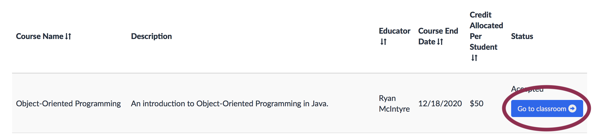

 * Click "Continue".

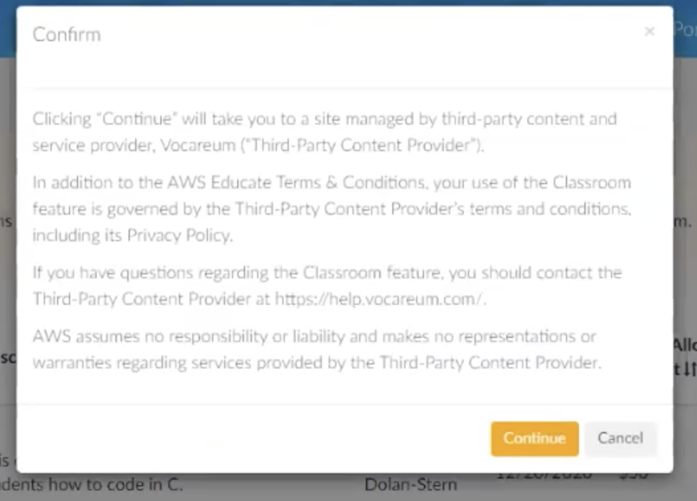

 * Click "AWS Console".

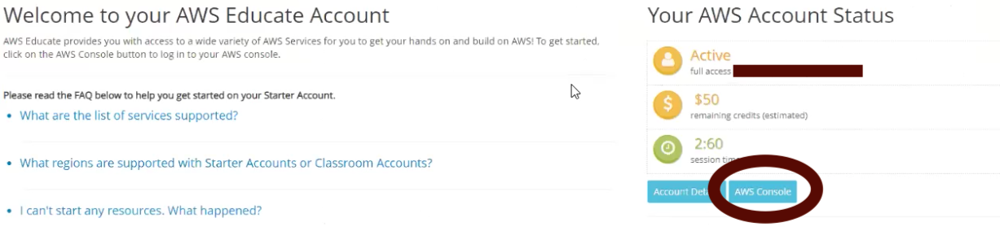

 * Under Recently Visited Services, you should see Cloud9. If this is not there, you might need to search for it in the "Find Services" text box.

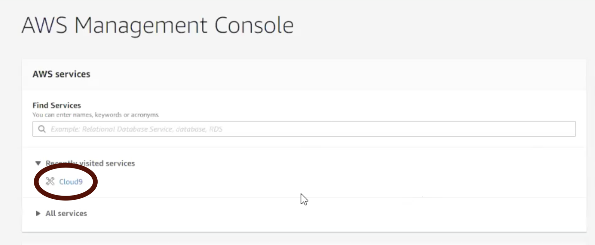

 * Finally, you should see the following screen and be able to click "Open IDE". You should not need to create another environment and I highly recommend against doing that; you should keep using this same environment all semester.

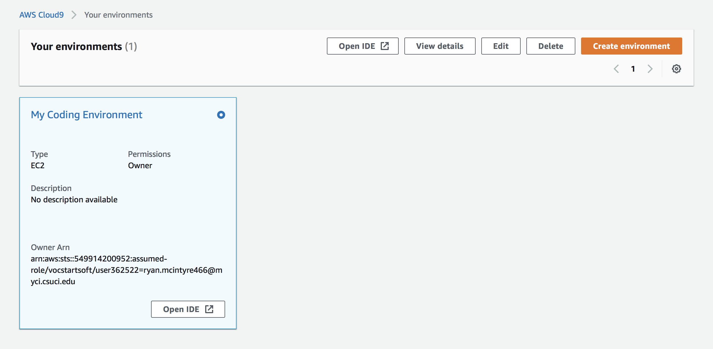

* There will be a short loading screen, after which you should have access to the IDE.

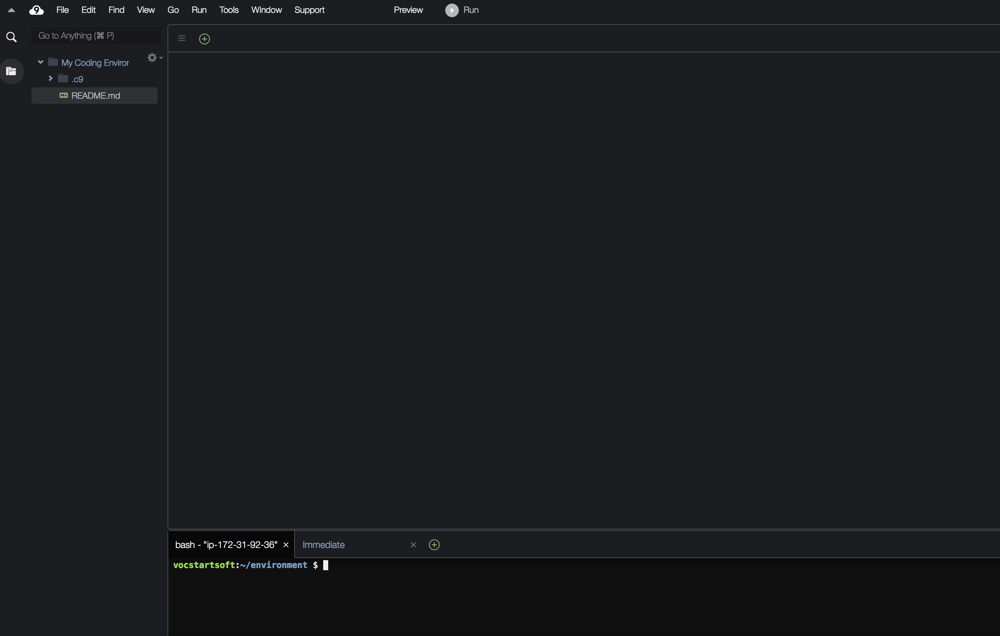

You might be looking at a welcome screen, this is closable.

I would like to mention here, that I am aware that this is a somewhat long series of steps. If anyone has found ways to shorten it, I am happy to hear them. However I think that the benefits of using this development environment outweigh its inconvienences.

# The Main Parts of the IDE

When first opening and looking at the IDE, you may be feeling a bit overwhelemed. There is a lot of text and different portions of the screen and it may not look like any type of application that you have used before. This is a normal, professional grade development environment, the types of which you will see every day if your career involves programming. Becoming comfortable with this type of application is absolutely essential to successful work in programming or Mechatronics Engineering. There are dozens or hundreds of different IDEs available but almost all of them work in a similar way and have most of the same look and features.

There are four portions to the screen that are really important.

* The Menu Bar
* The File Explorer
* The Code Editor
* The Terminal

## The Menu Bar

The Menu Bar is near the top of the browser web portion of the screen. It should say things like "File, Edit, Find, View...". Sometimes this bar will be hidden, and it can be made to reappear by hovering the mouse in the area in which it usually is.

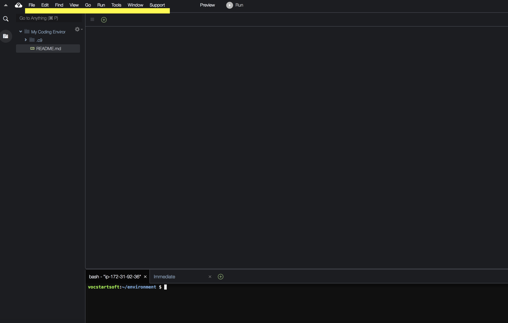

The Menu Bar contains a wide variety of tools and settings menus that you can use while you code. To be perfectly honest, I almost never use anything in the menu bar other than changing things like appearance settings. I accomplish most of these tools with keyboard shortcuts or terminal commands. At first, some of you will be more comfortable using the menu bar for things like saving or creating new files, but over time you will learn to rely on the same things that I do.

Feel free to explore the tools in the Menu bar. Most of the useful ones to you will be in "File, Edit, Find, and View". The other categories are typically geared towards larger projects and professionals. When changing settings though, try to be aware of what you are doing so that you do not make changes that you are not sure how to fix if you don't like them.

## The File Explorer

The File Explorer is on the left side of the screen, it begins with a search bar and then has a folder with a file called README.md in it. Feel free to click on the README to see a welcome message from AWS. It recommends that we make some files and play around with the terminal, and that's exactly what we are going to do.

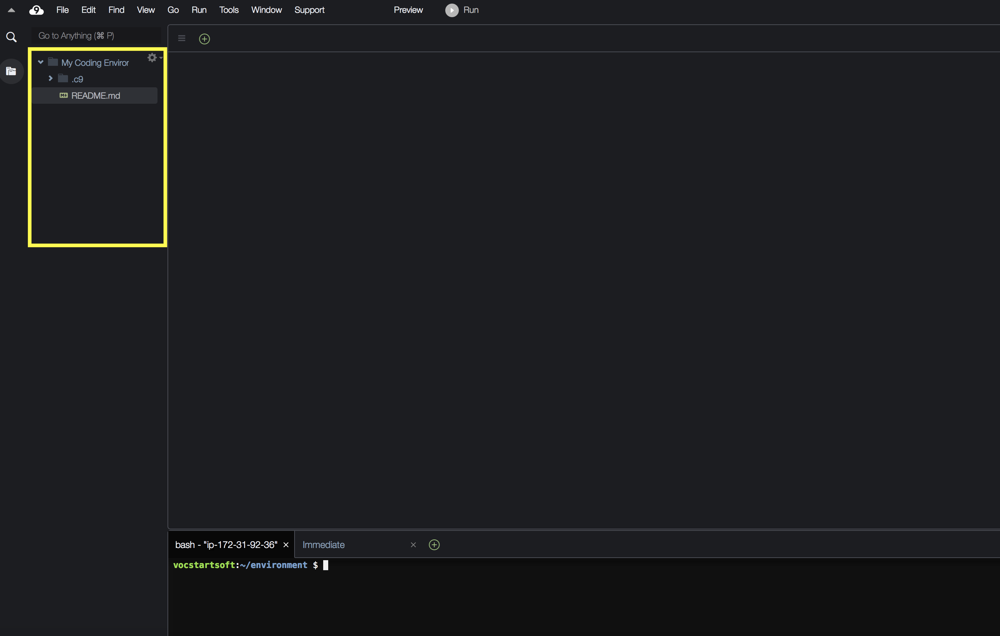

The file explorer is the primary place where we will create folders and files and manuever between them. By manuever between them I mean changing what is visible in the code editor.

When you right click inside of the file explorer, you get a variety of very useful options for working with files. These include things like:

* Open
* Download
* Run
* Rename
* Delete
* Duplicate, Cut, Copy, and Paste Files
* Create new file or folder

All of these are fairly self explanatory, and we will be using them often.

Try creating a file and naming it "HelloWorld.java".

The .java is important; without it, the Java compiler won't even try to compile it.

Make a folder as well and name it "Labs".

Your file explorer should look something like this:

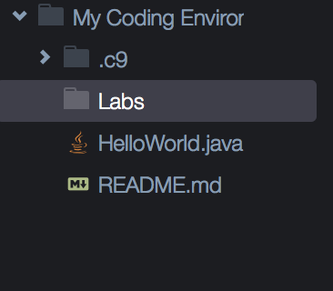

## The Code Editor

Click once or twice on the empty space immediately to the right of HelloWorld.java. We don't want to click on the file name itself because sometimes the IDE will think you are trying to rename it.

You should see something like the following screen

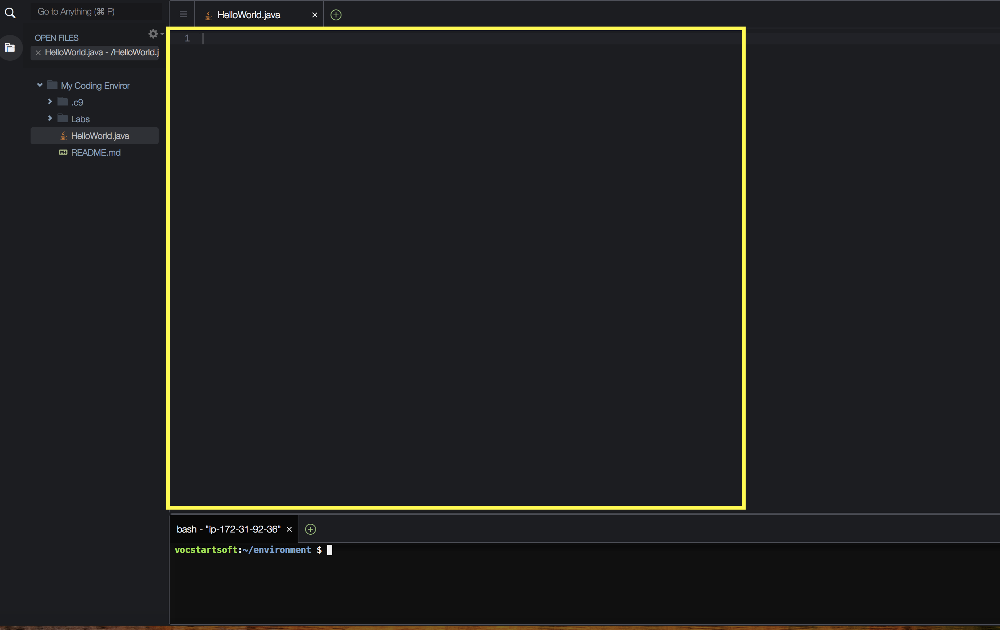

Notice that near the top of the screen, there is a tab with "HelloWorld.java" open. This a way we can easily switch between open files.

When our tab is open, we have the ability to write code for that file in the code editor portion of the screen.

The code editor is below the tabs, and to the right of the file explorer. It is roughly in the middle of the screen (it is the portion outlined in yellow in the picture above).

Type in or copy and paste the following code into the code editor for HelloWorld.java:

```java
class HelloWorld
{
    public static void main(String[ ] args)
    {
        System.out.println("Hello World!");
    }
}
```

### Saving

It is possible to turn on autosave in Cloud9, but it works via a delay. You are going to want to be saving and then compiling immediately with the most recent changes making it into the executable.

There are multiple ways to save a file in Cloud9. You can do it through the File menu in the menu bar, or I find it much easier to use the keyboard shortcut.

On Windows, the shortcut is CRTL S whereas on Mac it is COMMAND S.

You will notice that when a file has unsaved changes, it will have a dot next to its name rather than an X. Once you save, there will be a X rather than a dot.

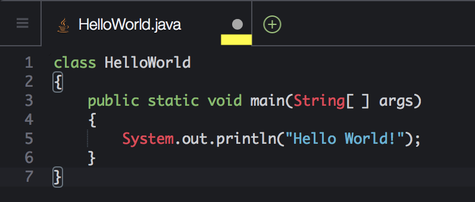
 
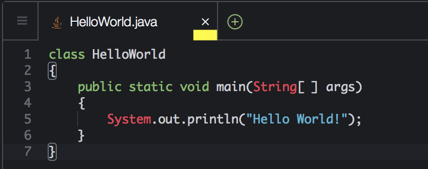

If you do not save your file before compiling it will not have the most recent version of the code. Instead the compiler will try to compile the last saved version. Oftentimes students will be confused about why they are getting some weird errors or output only to realize later that they have forgotten to save.

One way to check whether your code is saved and contains the content you want is by using a terminal command, so let's cover that next.

## The Terminal

We will be talking a lot more about the terminal in the next segment so I'll be pretty brief here.

The **terminal** is a console tool in which you can type **commands** which typically manipulate files and folders. The commands in the terminal are a part of their own programming language called BASH, but we will only be learning a small subset of BASH commands.

At first, it might seem inconvienent to use bash commands in the terminal rather than click buttons in the graphical user interface or GUI. However, for programmers it is absolutely *critical* that you learn to use the terminal. The terminal will be used constantly when working with systems that do not have GUIs built in. In this class, it is possible to get around using the terminal, but this will not be the case in classes like COMP 162 or COMP 362. I highly recommend biting the bullet and using the terminal as much as possible in this class, in order to be better prepared for when it is necessary in other classes. The terminal is a tool that I use every day that I am programming.

The terminal can be found near the bottom of the IDE screen. It will probably have some green and blue text, followed by a white dollar sign.

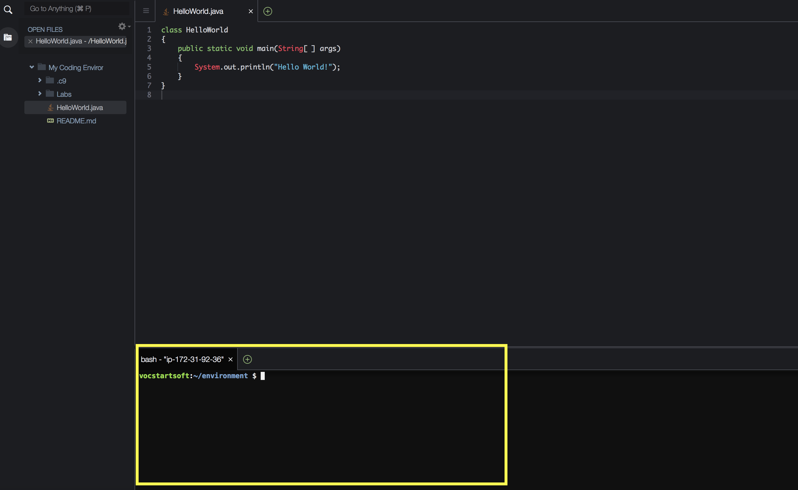

Make sure you click on this part of the screen in order to be able to type commands. Otherwise the commands that you type might be going into the code editor, these are two separate things.

### The cat Command

To check whether you have saved successfully, type the following command into the terminal and press enter:

```
cat HelloWorld.java
```

The result should look something like this:

```
vocstartsoft:~/environment $ cat HelloWorld.java 
class HelloWorld
{
    public static void main(String[ ] args)
    {
        System.out.println("Hello World!");
    }
}
vocstartsoft:~/environment $
```

The last set of right braces `}` might be missing; they will only show up in the cat call if there is an empty line following them in HelloWorld.java.

The **cat** command prints out the content of a provided file into the terminal. Sometimes I use it to check whether the thing I am compiling is what I am expecting.

Assuming that everything is properly saved we are now ready to compile.

### javac - The compile command

In order for the text of our source code to be translated into an executable the computer can run, it needs to be run through the C compiler.

The terminal command in order to do that is **javac**, which stands for "Java Compiler".

We write the command and then the file that we would like to be compiled and then press enter:

```
javac HelloWorld.java
```

When we do this, there should be a short pause, followed by a new terminal line being printed out. It will look something like this:

```
ec2-user:~/environment $ javac HelloWorld.java
ec2-user:~/environment $ 
```

If something was mistyped, it is possible that there are error messages or warnings. If this occurs, double check that you have exactly matched the contents of HelloWorld.java provided and try again.

With the compilation successful, a .class file has been generated by the compiler. We can actually see it in the File Explorer.

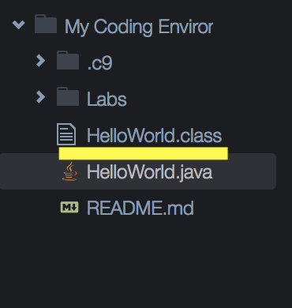

### java - The run command

In order to actually run our program, we need to use the java runtime environment. This is done with the **java** command, followed by the name of the class file generated by javac (without the trailing ".class").

In this case, we want to run our HelloWorld program, so we must enter the following command into the terminal and press enter:

```
java HelloWorld
```

The command above will not work unless HelloWorld.java has been successfully compiled by javac; if there were any errors compiling, then HelloWorld.class was not generated, so there is nothing to run.

We should see the following result:

```
vocstartsoft:~/environment $ java HelloWorld 
Hello World!
vocstartsoft:~/environment $
```

This may not seem like much, but you have now written, compiled, and run your first Java program using a set of professional programming tools. The steps that you have followed here are ones you will repeat again and again both as you learn to program, and when you program professionally.

# The Cycle of Programming

An important takeaway from this segment is the action process that we went through. This is the same sequence of actions that I do everyday in my professional life.

1. We create the necessary files we are going to program in.
2. We write the code in those files. (In future labs, they won't just be provided to you).
3. We save the changes.
4. We compile the code using **javac** followed by the name of the Java file we wrote.
5. We run the code using the **java**, followed by the name of the generated class file.

Missing any of these steps, or doing them in the wrong order will cause us to not get the output we expect. When we get unexpected results one of the first things we should do is ensure that we have gone through steps 3-5, and in the correct order. I forget to save all the time!

# Compiling and Running without the Terminal

Cloud9, like most IDEs, has a shortcut to compile and run in one click. This can be done with the "Run" button to the right of the menu bar.

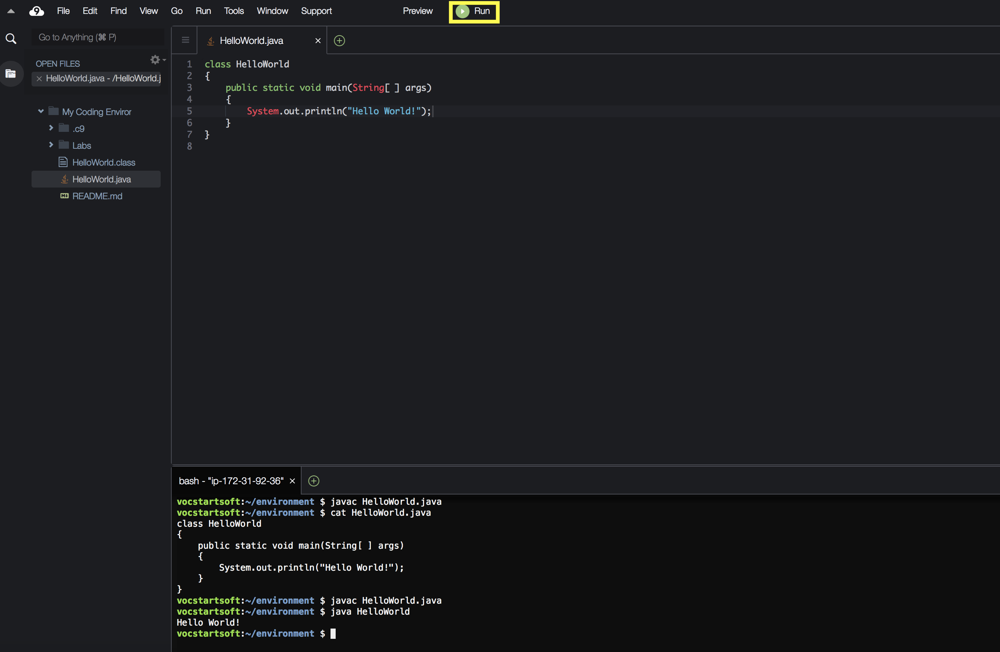
 
However, this is generally a bad idea when developing a program, and I advise against it. The shortcut is too simple, and this can lead to issues. Here's what it does:

1. Tries to compile the specified Java file.
2. Tries to run the corresponding class file, whether or not the compilation was successful.

When the program compiles correctly, this is fine. Try hitting the run button; your program will run just like before, except the output will be in a new tab next to your terminal. 

Issues arise, however, when you make a mistake in editing a file so it no longer compiles correctly; step 1 fails, but step 2 just runs on the old .class file from a previous successful compile.

To see this issue, try doing something to break HelloWorld.java, so it won't compile, and then hit run. You can see I removed a semicolon:

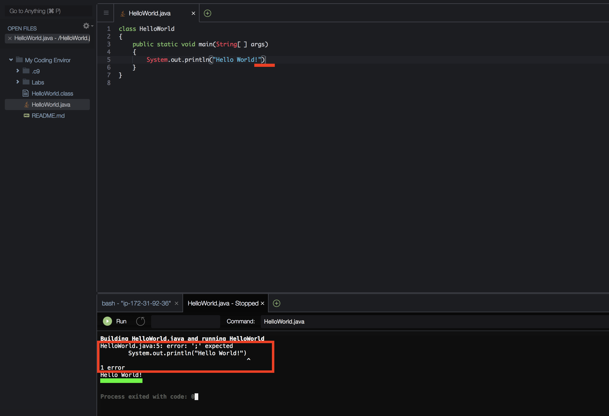
 
The issue above is: 

* The removed semicolon causes HelloWorld.java to not compile; you can see the missing semicolong underlined in red in the code editor, and the failed compile outlined in read in the terminal.
* The program still ran (using the **old** version of HelloWorld.class from before I broke it) and printed "Hello World!" out into the console, which you can see underlined in green in the terminal.

If I instead delete the old HelloWorld.class before trying this run shortcut with a broken program, this is the result:

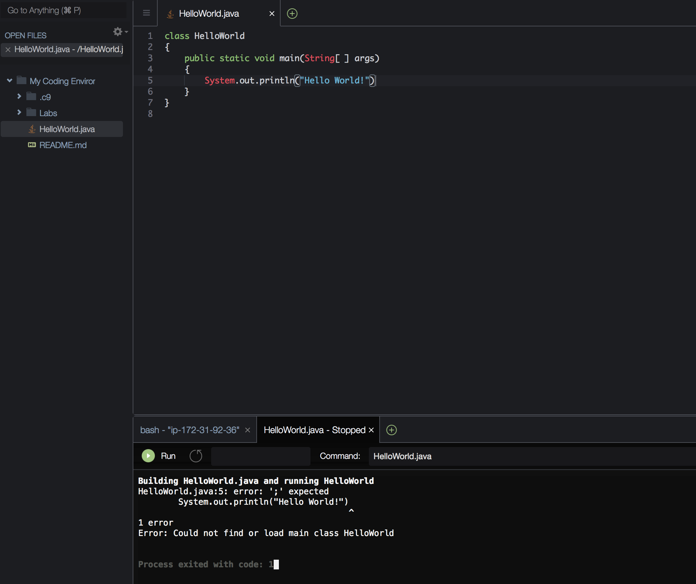

Because the compilation process fails, no class file is generated, so the run doesn't work either.

This might not seem like an issue in this context; you can clearly see errors warning of a failed compile. With more complex programs, however, the compiler errors might be hidden further up in the terminal because the program output itself might be longer. This can make it seem like none of the edits being made to the java file are having any effect.

# The Program

Now that we've compiled and run a program, let's discuss its contents in a little more detail.

```java
class HelloWorld
{
    public static void main(String[ ] args)
    {
        System.out.println("Hello World!");
    }
}
```

When we run this program, we get the output

```
Hello World!
```

You have probably guessed that the line that actually produces the output is:

```
System.out.println("Hello World!");
```

We will talk about how this line works in a little bit, but before that I want to discuss the surrounding lines.

If we remove the print line from the program we have the following:

```java
class HelloWorld
{
    public static void main(String[ ] args)
    {
        
    }
}
```

This is a bare-bones Java program. If we compile and run it, nothing happens.

## `class HelloWorld`

Every Java program consists of a collection of one or more classes. A class is a collection of data and methods. This is by no means a full description, and we will answer the question "What is a class?" in much more detail as we progress through this course.

The line `class HelloWorld` specifies that:

* a new class is being defined
* this class is named `HelloWorld`

The contents of the class are then specified in the following curly braces `{}`:

```java
{
    public static void main(String[ ] args)
    {
        
    }
}
```

## `public static void main(String[] args)`

Every Java program contains a main method. The main method specifies what actions should be taken, and in what order. We'll discuss what each word means here, but don't worry if it doesn't sink in here; throughout this course, we will discuss what each of these keywords means in detail, and by the end of the course this whole line will make perfect sense.

The main method is always `public`, meaning that it is accessible by all other classes. It is `static`, meaning it is associated with the class itself (as opposed to objects constructed by the class). It is `void`, meaning it doesnt return (i.e. "result in" or "output") anything. It is named `main`, which is an identifier reserved for the main method.

`(String[] args)` specifies that the main method takes an array of strings (i.e. sequences of characters) as its inputs (or **arg**uments).

The following curly braces `{}` specify the contents of the main method, which specify what the program should do. In this case, there is nothing in the braces, so the program doesn't do anything.

## `System.out.println("Hello World");`

This line prints "Hello World!" to the console. We will disect this statement in much more detail in future readings.

# Conclusion

In this segment we have been introduced to the basics of using an IDE, or Integrated Development Environment. You have learned about the purpose and location of its major components. You have learned the steps for creating and executing Java programs using the terminal. All of these concepts are not just critical to this class, but most will be used nearly every time you program throughout your career.
