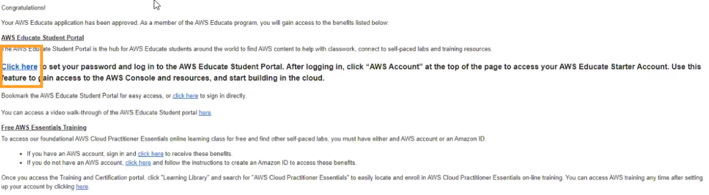
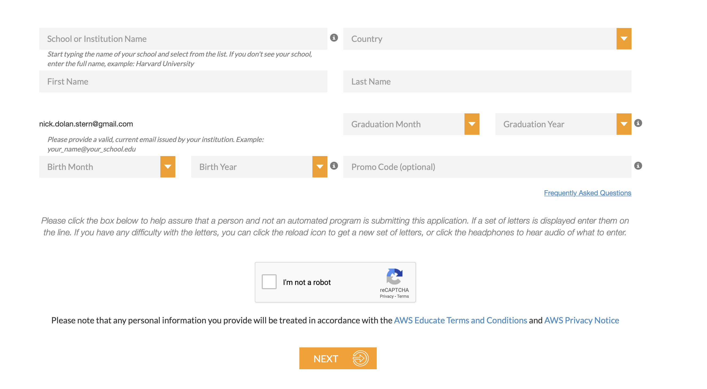

In this segment we will discuss the first steps for setting up your Cloud9 development environment.

If you get stuck at any point in this process, please do not hesitate to contact me. It is absolutely imperative that you get this set up as soon as possible. Once you get it setup, it is much easier to use.

# Activate Your Account Through The Email Sent To You

As a member of this class, you should have recieved an email invitation to access the AWS resources for this class. It will be sent to you at your myci.csuci.edu email address. This email will have the subject line:

```
Your AWS Educate Application
```

The email will look something like this:



If you do not see this email, first check appropriate Spam folders, and then contact me so that I can resend it.

You are going to want to click the "here" link inside of the email and fill out the application. The application will look something like this:



Do not worry about the promo code section, and set your graduation date to something reasonable. Enter the other information and click "Next".

Sometimes you will get another screen, or it might take you right to the email verification step. If you have another screen, on the choose one of the following page, select "Click here to select an AWS Educate Starter Account", and then choose "Next".

You then should recieve an email from AWS meant to confirm that you actually own the provided email address. Weird, given that you got to this page from that email address, but whatever. Verify your email address by clicking the link in that email.

After clicking next, it should tell you that your application was recieved and that you will be emailed when it is processed. This processing is said to usually take 1 day. **Don't close this window until you have submitted your assignment.**

