# Introduction

In this reading we will talk about setting up your **development environment**, the place where you go to write and run code. The tool that we will be using for this class is called Cloud9 and is offered through Amazon Web Services or AWS.

This class has always been taught in a computer lab, with the development environment already set up for you. I am typically able to walk around and assist you and see where you are stuck. Going virtual has impacted that in a severe way, and requires some workarounds. Cloud9 is not a tool I have used to teach before, but I feel it is important to explore new possibly better suited options rather than to stay in one's comfort zone. After researching my options, I felt that Cloud9 was the best option to use for this class for the following reasons:

* Anyone with access to the internet can access it at any time without needing to install anything. This is extremely important as all of you might have different types of computers.
* It is free (at least to the degree that we are using it)
* It has a built in UNIX based terminal (this is a tool you need to start getting comfortable with for your future classes and careers)
* It has a variety of features built in for collaboration, sharing, and chat support. I felt that this helps replicate the normal classroom environment.

It is important to note that when using Cloud9 , you are not actually running it on your own computer. You are actually connected to a different computer over the internet. Any changes you make will not affect your computer and instead will stay on the computer Cloud9 is connected to. Each time you log in to Cloud9 you connect automatically to the same computer, even if you are connecting from a different one.

That being said, it seems one of the biggest pain points of using Cloud9 is that it takes several steps to set up and be ready for coding. It is therefore extremely important that you follow the steps in this reading in order to make this process as simple as possible. There is a validation process that can take up to a day or two, and so it is important that you start this process as soon as possible.

If you get stuck at any point in this process, please do not hesitate to contact me. It is absolutely imperative that you get this set up as soon as possible. Once you get it setup, it is much easier to use.

# Step 1 Activate Your Account Through The Email Sent To You

As a member of this class, you should have recieved an email invitation to access the AWS resources for this class. It will be sent to you at your myci.csuci.edu email address. This email will have the subject line:

```
Your AWS Educate Application
```

The email will look something like this:

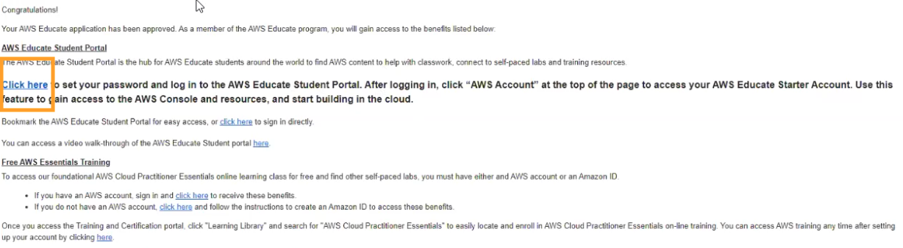

If you do not see this email, first check appropriate Spam folders, and then contact me so that I can resend it.

You are going to want to click the "here" link inside of the email and fill out the application. The application will look something like this:

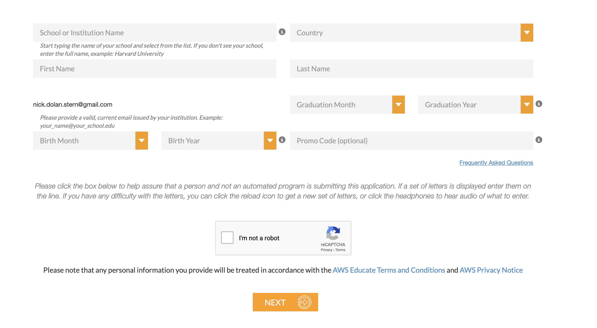

Do not worry about the promo code section, and set your graduation date to something reasonable. Enter the other information and click "Next".

Sometimes you will get another screen, or it might take you right to the email verification step. If you have another screen, on the choose one of the following page, select "Click here to select an AWS Educate Starter Account", and then choose "Next".

You then should recieve an email from AWS meant to confirm that you actually own the provided email address. Weird, given that you got to this page from that email address, but whatever. Verify your email address by clicking the link in that email.

After clicking next, it should tell you that your application was recieved and that you will be emailed when it is processed. This processing is said to usually take 1 day.

After AWS Educate approves your application, AWS will send you an email with the title "AWS Educate Application Approved". 

You will not be able to progress further in setting up your development environment until this application has been processed. 

While you wait, I would recommend doing the following course segments, none of them require a development environment:

* Intro to Me
* Intro to Course
* What is Programming?
* Intro to C

Come back to this segment once you got the Application Approved email.

# Step 2: Sign Into Your AWS Educate Account

When you get the approval email, follow the instructions in it to set your AWS Educate Student Portal password, and then sign in to your AWS Educate Student Portal. 

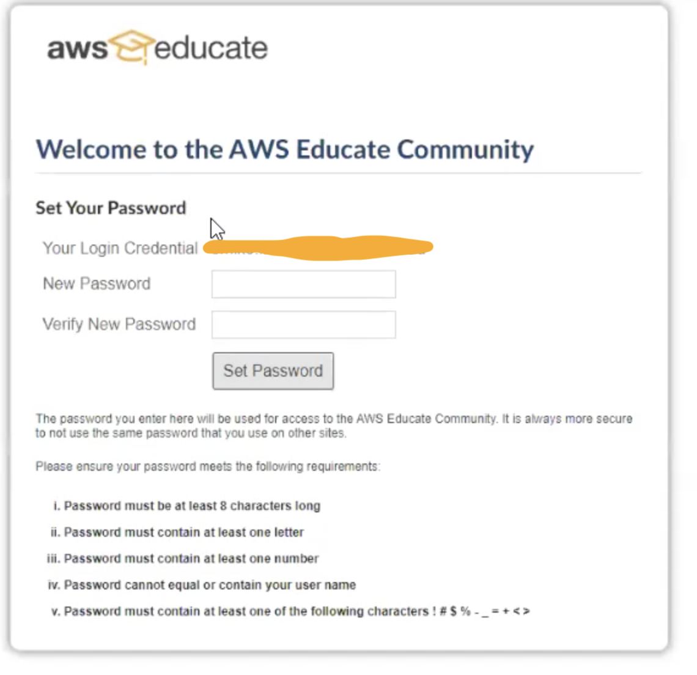

After you set your AWS Educate Student Portal password, store that password in a secure location. You will be using these credentials all semester, although you can recover your password if you forget it.

# Step 3: Go Into The AWS Classroom

Once setting your password, you should be on the following screen. You are going to want to go to "My Classrooms". It is one of the large colorful buttons near the bottom of the screen.

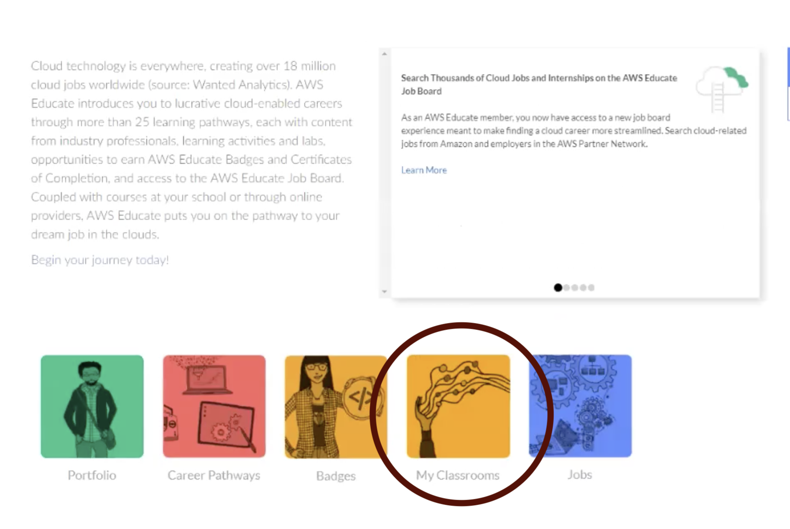


It is possible for you to have multiple classes using AWS, but if you are following this guide, you probably only have one. On the row with "Intro to Programming Using C" click the big blue "Go to Classroom" button.

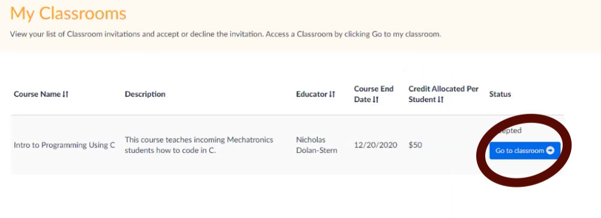

At this point a pop up message will display regarding the Terms and Conditions for the website. Read these to the degree that you wish. Then click "Continue" to proceed.

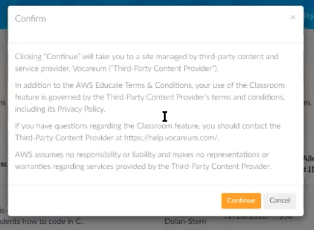

You are then going to be redirected to a page containing more conditions. Again, read these to the degree that you wish. Eventually you will reach the bottom of these, and be able to click "I agree"

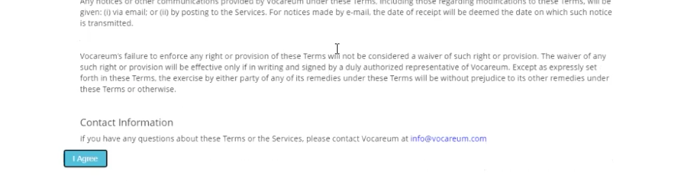

# Step 4: Go to the AWS Console

You will now be on a page with a lot of different things going on that looks kind of confusing. On the right half of the screen there will be two blue buttons. You want to click the button "AWS Console".


At this point you will be presented with the AWS Management Console. While we are using it for a very specific purpose in this class, this is a tool that millions of developers use to do Cloud Computing. I have used it every day in my work for the past 2 years.

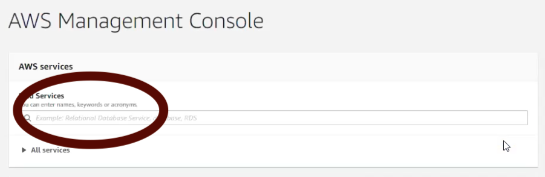

You will notice that near the middle of the screen there is a search box.

Inside of the search box, type Cloud9 and click on it when it appears in the results.

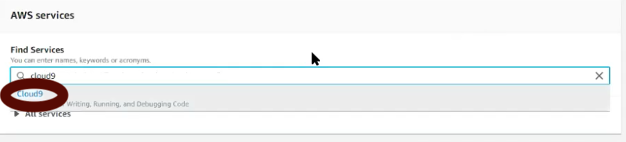

# Step 5: Setting Up Cloud9

You should now be on a screen introducing Cloud9. On the right side of the screen there is an orange button that says "Create Environment", this is where you need to go next.

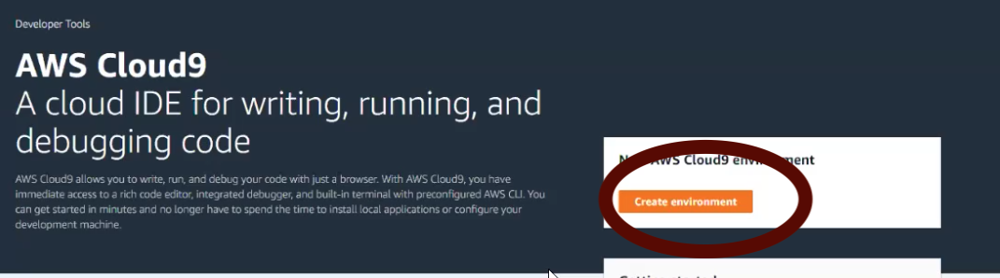

You should now see a form asking for a name and description for the environment. Give the environment a name like "My Coding Environment". Don't worry about the description. Then click "Next Step"

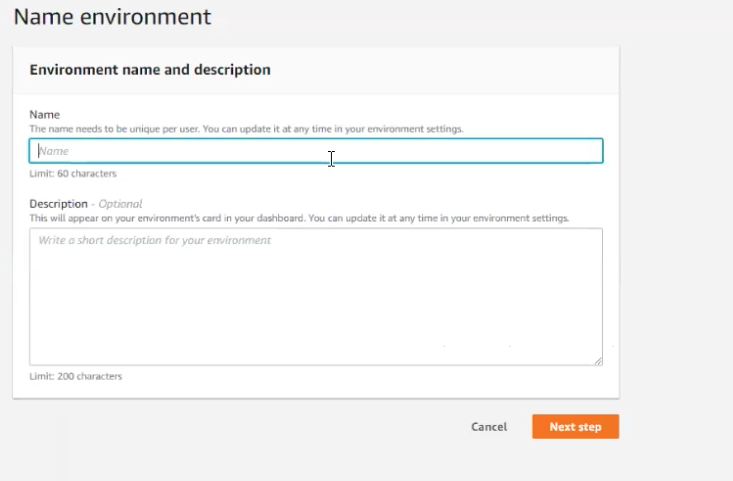

You will now be on a screen with what looks like a lot of scary options that you don't understand. These are different computer options. Don't worry about them. For this class, you will only need the most basic computer. So, you are going to ignore all of these options. Instead, just scroll to the bottom.

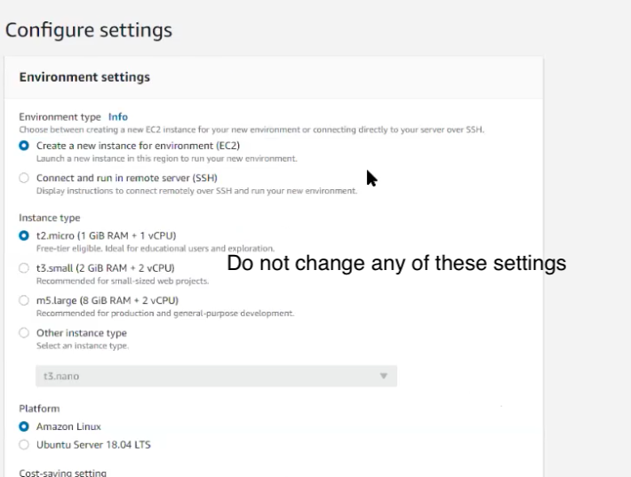

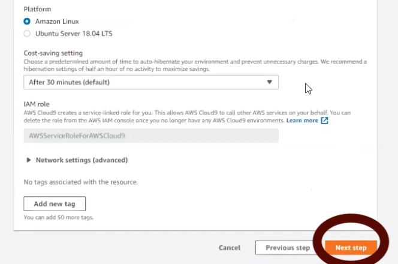

You will next be on a review screen, scroll to the bottom and click "Create Environment"

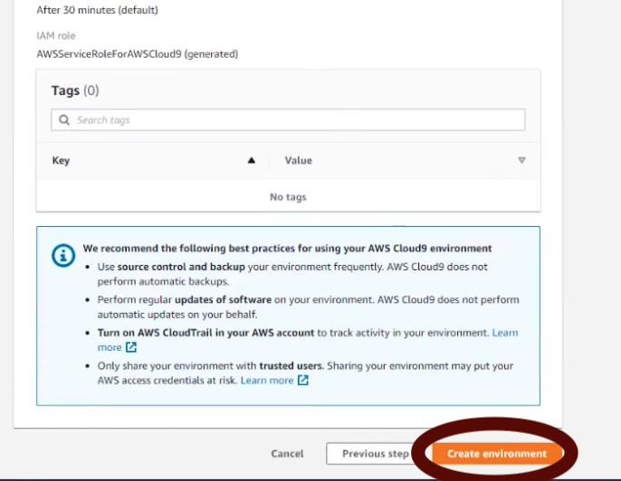

You should be now on a loading screen that says it is creating your Cloud9 environment. Congratulations, you have basically finished.

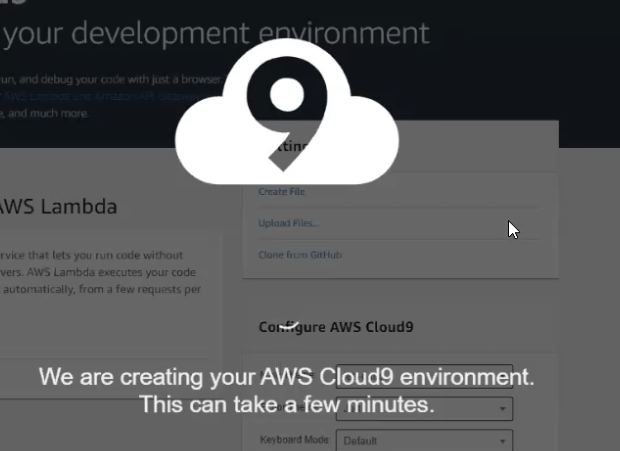

You should now be on a welcome screen. Near the top, there is a bar that says Welcome, you can click x to close this welcome screen.

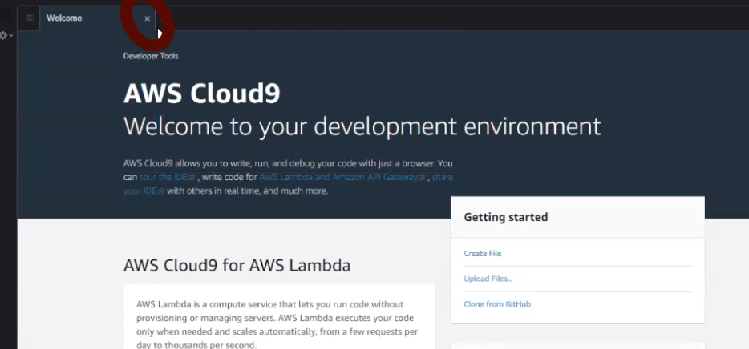


You should now see a mostly black screen. Don't worry, this is where you want to be.

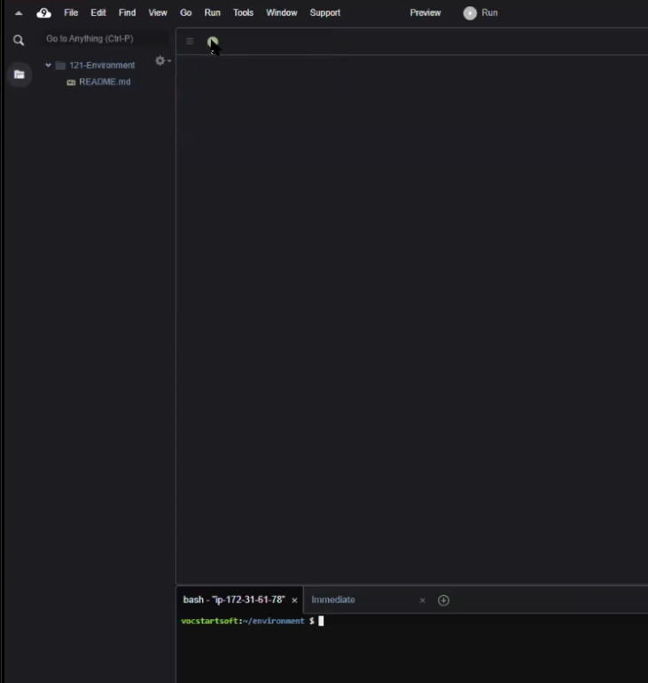

# Conclusion

I know this was a long process, but after this the process of typically logging in and using the environment is much shorter than this initial setup. We will not have to do this process again until next semester when the classroom expires.

When you have completed the setup process, make sure that you have also finished the following segments:

* Intro to Me
* Intro to Course
* What is Programming?
* What is C?
* Intro to Pathing

Once these are completed you should head to the segment titled "Using the Development Environment".